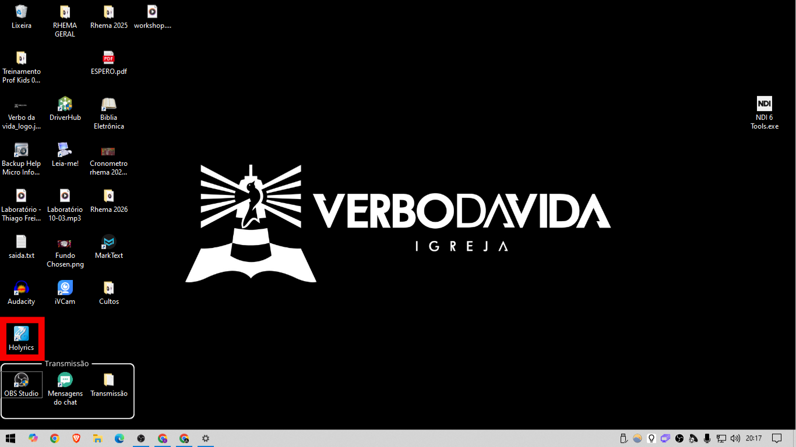

# Holyrics - Monitor do palco

---

## Configurações iniciais

Primeiramente, abra o Holyrics

  
Clique na opção *ferramentas* e depois em *Plugin holyrics* 

Clique na opção *Ativar servidor*

Isso faz aafhfhdkasf fadshjkadsfh jkadsfhkjasdf hkfjasd sjka ghuir arwejkdfsahkjsdfah fkasdj hksdfja hjka

<a href="/assets/Holyrics/1_area_de_trabalho.png" target="_blank">

  </a>
<a href="/assets/Holyrics/1_area_de_trabalho.png" target="_blank">

  </a>
<a href="/assets/Holyrics/1_area_de_trabalho.png" target="_blank">

  </a>
<a href="/assets/Holyrics/1_area_de_trabalho.png" target="_blank">
### Ativando o servidor
  </a>

### Enviando para o monitor

---

## Contagens regressivas

---

## Durações das etapas dos cultos

### Quinta feira

- Louvor: **10** minutos

- Ministração: **40** minutos

- Avisos: **10** minutos

### Domingo de Celebração

- Louvor: **30** minutos

- Ministrações: **50** minutos

- Avisos: **10** minutos

#### Programações adicionais

- Momento de ceia: **10** minutos

- Momento missionário: **10** minutos

---
